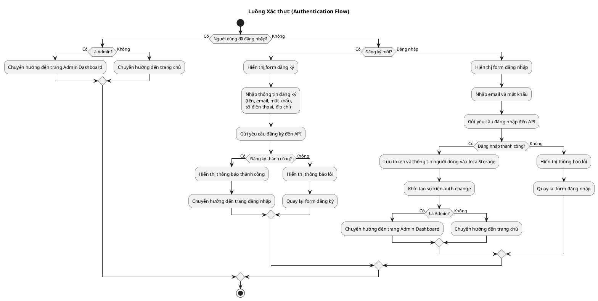
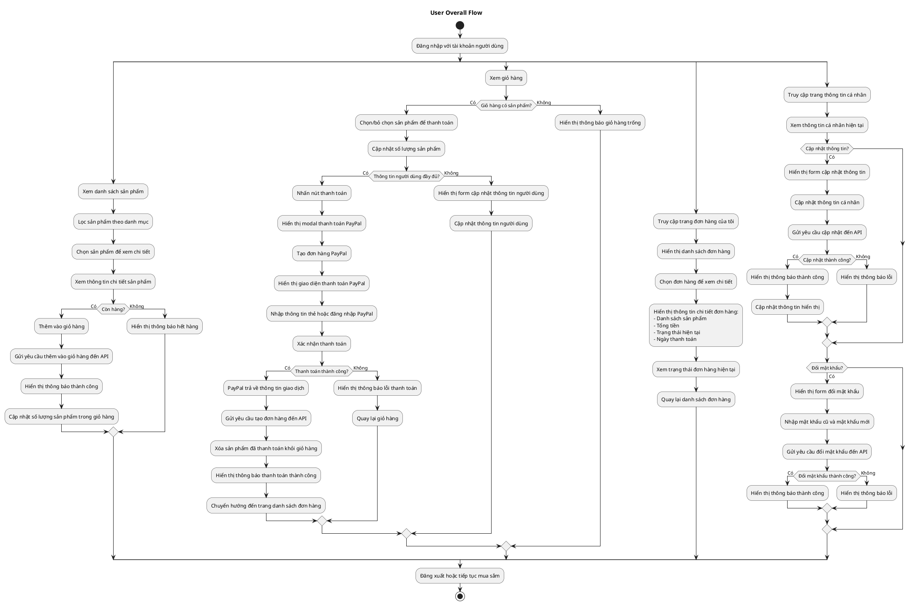
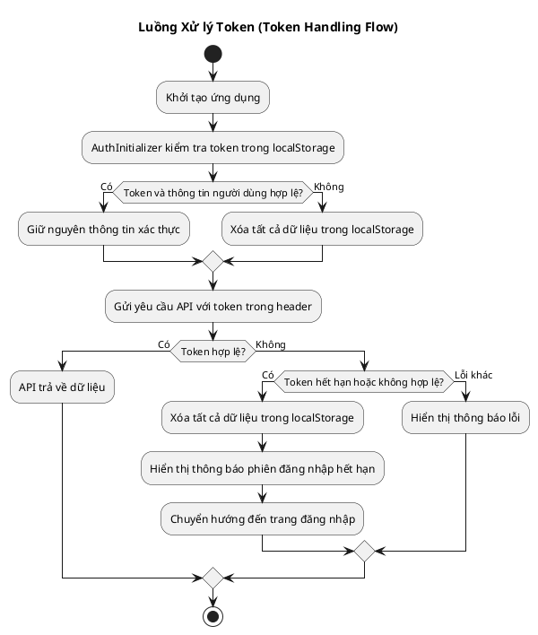
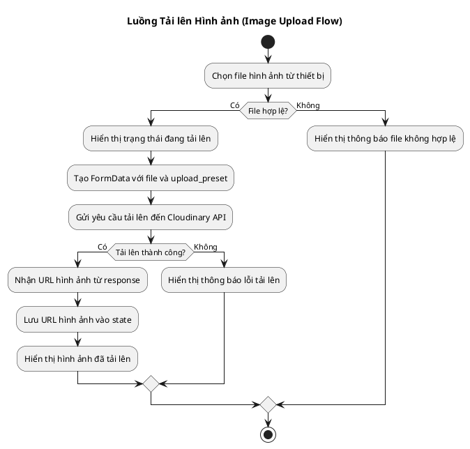

# Activity Diagrams cho Hệ thống E-commerce

Tài liệu này chứa các Activity Diagram mô tả các luồng chính trong hệ thống e-commerce, được tạo bằng PlantUML.

## 1. Luồng Xác thực (Authentication Flow)

## 2. Luồng Người dùng Tổng thể (User Overall Flow)

## 3. Luồng Quản lý Admin Tổng thể (Admin Overall Flow)

```plantuml
@startuml Admin Overall Flow
title Admin Overall Flow

start

:Đăng nhập với tài khoản Admin;

:Truy cập Admin Dashboard;

split
  ' Thống kê tổng quan
  :Xem thống kê tổng quan;
  :Hiển thị số liệu thống kê:
  - Tổng số đơn hàng
  - Doanh thu
  - Số lượng sản phẩm
  - Số lượng người dùng;

split again
  ' Quản lý Sản phẩm
  :Truy cập trang quản lý sản phẩm;
  :Hiển thị danh sách sản phẩm;

  split
    :Thêm sản phẩm mới;
    :Hiển thị form thêm sản phẩm;
    :Nhập thông tin sản phẩm
    (tên, giá, mô tả, tính năng,
    số lượng, danh mục);
    :Tải lên hình ảnh sản phẩm lên Cloudinary;
    :Gửi yêu cầu tạo sản phẩm đến API;

    if (Tạo sản phẩm thành công?) then (Có)
      :Hiển thị thông báo thành công;
      :Cập nhật danh sách sản phẩm;
    else (Không)
      :Hiển thị thông báo lỗi;
    endif
  split again
    :Chỉnh sửa sản phẩm;
    :Chọn sản phẩm cần chỉnh sửa;
    :Hiển thị form chỉnh sửa với thông tin hiện tại;
    :Cập nhật thông tin sản phẩm;
    :Gửi yêu cầu cập nhật sản phẩm đến API;

    if (Cập nhật sản phẩm thành công?) then (Có)
      :Hiển thị thông báo thành công;
      :Cập nhật danh sách sản phẩm;
    else (Không)
      :Hiển thị thông báo lỗi;
    endif
  split again
    :Xóa sản phẩm;
    :Chọn sản phẩm cần xóa;
    :Hiển thị xác nhận xóa;

    if (Xác nhận xóa?) then (Có)
      :Gửi yêu cầu xóa sản phẩm đến API;

      if (Xóa sản phẩm thành công?) then (Có)
        :Hiển thị thông báo thành công;
        :Cập nhật danh sách sản phẩm;
      else (Không)
        :Hiển thị thông báo lỗi;
      endif
    else (Không)
      :Hủy xóa sản phẩm;
    endif
  end split
split again
  ' Quản lý Danh mục
  :Truy cập trang quản lý danh mục;
  :Hiển thị danh sách danh mục;

  split
    :Thêm danh mục mới;
    :Hiển thị form thêm danh mục;
    :Nhập tên danh mục;
    :Gửi yêu cầu tạo danh mục đến API;

    if (Tạo danh mục thành công?) then (Có)
      :Hiển thị thông báo thành công;
      :Cập nhật danh sách danh mục;
    else (Không)
      :Hiển thị thông báo lỗi;
    endif
  split again
    :Chỉnh sửa danh mục;
    :Chọn danh mục cần chỉnh sửa;
    :Hiển thị form chỉnh sửa với tên hiện tại;
    :Cập nhật tên danh mục;
    :Gửi yêu cầu cập nhật danh mục đến API;

    if (Cập nhật danh mục thành công?) then (Có)
      :Hiển thị thông báo thành công;
      :Cập nhật danh sách danh mục;
    else (Không)
      :Hiển thị thông báo lỗi;
    endif
  split again
    :Xóa danh mục;
    :Chọn danh mục cần xóa;
    :Hiển thị xác nhận xóa;

    if (Xác nhận xóa?) then (Có)
      :Gửi yêu cầu xóa danh mục đến API;

      if (Xóa danh mục thành công?) then (Có)
        :Hiển thị thông báo thành công;
        :Cập nhật danh sách danh mục;
      else (Không)
        :Hiển thị thông báo lỗi;
      endif
    else (Không)
      :Hủy xóa danh mục;
    endif
  end split
split again
  ' Quản lý Đơn hàng
  :Truy cập trang quản lý đơn hàng;
  :Hiển thị tất cả đơn hàng trong hệ thống;

  split
    ' Xem chi tiết đơn hàng
    :Chọn đơn hàng để xem chi tiết;
    :Hiển thị thông tin chi tiết đơn hàng:
    - Thông tin khách hàng
    - Danh sách sản phẩm
    - Tổng tiền
    - Trạng thái hiện tại
    - Ngày thanh toán;
  split again
    ' Cập nhật trạng thái đơn hàng
    :Chọn đơn hàng cần cập nhật;
    :Hiển thị tùy chọn cập nhật trạng thái;
    :Chọn trạng thái mới
    (pending, processing, shipped,
    delivered, completed);
    :Gửi yêu cầu cập nhật trạng thái đến API;

    if (Cập nhật thành công?) then (Có)
      :Hiển thị thông báo thành công;
      :Cập nhật thông tin đơn hàng;
    else (Không)
      :Hiển thị thông báo lỗi;
    endif
  split again
    ' Thống kê đơn hàng
    :Xem thống kê đơn hàng theo trạng thái;
    :Hiển thị biểu đồ phân bố đơn hàng;
    :Xem doanh thu theo thời gian;
    :Hiển thị biểu đồ doanh thu;
  end split
end split

:Đăng xuất hoặc tiếp tục quản lý;

stop
@enduml
```

## 4. Luồng Xử lý Token (Token Handling Flow)

## 5. Luồng Tải lên Hình ảnh (Image Upload Flow)

## Cách sử dụng các Activity Diagram

Các Activity Diagram trên mô tả các luồng chính trong hệ thống e-commerce. Để sử dụng các diagram này:

1. Sao chép mã PlantUML vào công cụ hỗ trợ PlantUML như [PlantUML Online Server](http://www.plantuml.com/plantuml/uml/) hoặc plugin PlantUML trong các IDE như Visual Studio Code, IntelliJ IDEA.

2. Render diagram để xem biểu đồ trực quan.

3. Sử dụng các diagram này để:
   - Hiểu rõ luồng hoạt động của hệ thống
   - Tài liệu hóa quy trình nghiệp vụ
   - Trình bày với các bên liên quan
   - Hỗ trợ phát triển và bảo trì hệ thống

Các Activity Diagram này có thể được mở rộng hoặc điều chỉnh để phản ánh chính xác hơn các yêu cầu cụ thể của dự án.
